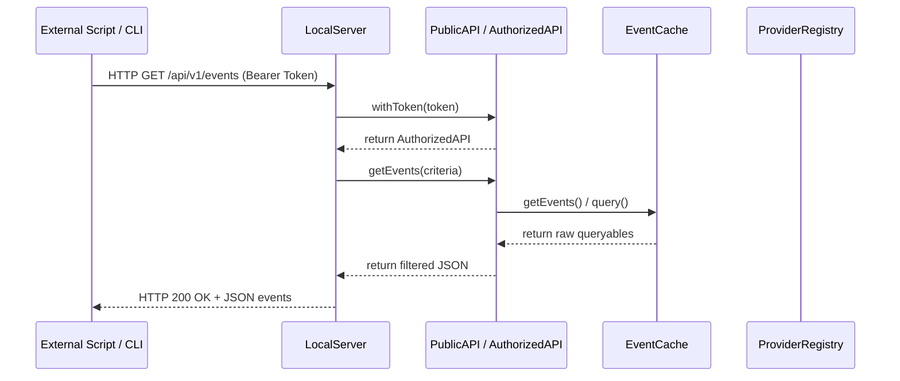

# API Architecture

!!! abstract "Purpose"
    The Full Calendar API exposes safe, permissioned entry points for other plugins and external systems while keeping [`EventCache`](eventcache.md) as the single source of truth.

## Components and Ownership

| Component | Responsibility | Must Not Own |
|---|---|---|
| [`PublicAPI`](../../src/api/FullCalendarAPI.ts#L368) | Bouncer surface on `app.plugins.plugins['full-calendar'].api`. Handles token verification, [Personal Access Tokens (PATs)](#personal-access-tokens-pats), and plugin access request modals. | Direct event state or provider I/O. |
| [`LocalServer`](../../src/api/LocalServer.ts) | Localhost HTTP server (127.0.0.1) running in Node.js. Translates incoming REST API requests (Bearer Token) into programmatically executed operations. | UI presentation or file writing policies. |
| [`InternalAPI`](../../src/api/FullCalendarAPI.ts#L34) | Executes raw actions (querying, opening views, modifying events) using [`PluginState`](core-systems.md). | Third-party validation logic or CLI exposure. |
| [`PluginState`](core-systems.md) | Runtime singleton holding references to settings, cache, registry, and system capabilities. | Alternative sources of state. |
| [`EventCache`](eventcache.md) | Canonical cached event state and database mutations. | UI decisions or CLI protocol formatting. |
| [`ProviderRegistry`](../calendars/architecture.md) | Network/Local calendar source route management and synchronization. | Client filtering engines. |

## Authorization & Token Storage

The API uses standard scope-gated capability tokens stored under [`FullCalendarSettings.apiTokens`](../../src/types/settings.ts#L190).
* **Plugin Tokens**: Acquired via [`PublicAPI.requestAccess(pluginId, reason, requestedScopes)`](../../src/api/FullCalendarAPI.ts#L379) showing an authorization modal. Stored with the calling plugin's identifier.
* **Personal Access Tokens (PATs)**: Generated manually by the user in settings. Stored with a fixed `pluginId: 'personal'`. Prefixed with `ofc_pat_` to prevent collisions.
* **Tracking**: On access via [`PublicAPI.withToken(token)`](../../src/api/FullCalendarAPI.ts#L428), `lastUsedAt` is updated and persisted asynchronously to disk.

## Scope Model

Methods require a specific scope (e.g. `events:read`, `events:write`, `ui:open-calendar`, `providers:read`). 
`system:full-access` provides raw access to singletons via [`AuthorizedAPI.getInternalState()`](../../src/api/FullCalendarAPI.ts#L356).

## Local REST Server

When `enableLocalServer` is toggled in settings:
1. [`LocalServer`](../../src/api/LocalServer.ts) opens an HTTP listener on the configured `localServerPort` (default `8540`) bound to `127.0.0.1` (localhost).
2. It intercept requests, validates `Authorization: Bearer <token>` against [`PublicAPI.withToken()`](../../src/api/FullCalendarAPI.ts#L428), and checks scopes.
3. Requests map to the [`AuthorizedAPI`](../../src/api/FullCalendarAPI.ts#L317) surface.

### Supported REST Routes

* **Events**:
  * `GET /api/v1/events` -> Returns JSON array of events matching criteria (`events:read`). Query parameters: `start` (ISO/ms), `end` (ISO/ms), `calendar` (IDs), `query` (text search), `isTask` (bool), `isCompleted` (bool).
  * `GET /api/v1/events/:id` -> Detailed event object & source file path (`events:read`).
  * `POST /api/v1/events` -> Create event in source (`events:write`).
  * `PUT /api/v1/events/:id` -> Update event details (`events:write`).
  * `DELETE /api/v1/events/:id` -> Remove or suppress event (`events:write`).
* **UI Controls**:
  * `POST /api/v1/ui/open-calendar` -> Open main calendar leaf (`ui:open-calendar`).
  * `POST /api/v1/ui/open-sidebar` -> Focus right sidebar (`ui:open-sidebar`).
  * `POST /api/v1/ui/change-view` -> Switch view (e.g., `timeGridWeek`) (`ui:change-view`).
* **System/Sync**:
  * `GET /api/v1/calendars` -> List configured calendars and sources (`providers:read`).
  * `POST /api/v1/providers/revalidate` -> Trigger background sync/reload (`providers:write`).
  * `GET / PUT /api/v1/settings` -> Read/update plugin settings (`settings:read`/`settings:write`).

---

## Data Flow

## Constraints and Invariants

* **Process Boundary Security**: The server binds *strictly* to `127.0.0.1` preventing network exposure.
* **State Isolation**: Writes always flow through the [`EventCache`](eventcache.md) mutating the source file or network provider, rather than modifying memory representations.
* **Platform Exclusions**: The [`LocalServer`](../../src/api/LocalServer.ts) checks [`PluginState.isMobile()`](../../src/main.ts#L141) and disables itself on mobile platforms to prevent Capacitor runtime errors.
