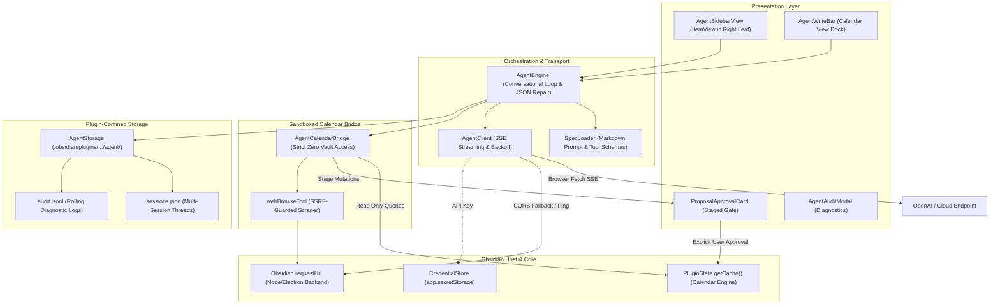

# Calendar Agent Architecture

This document details the architectural layout, security constraints, data flow, and components of the **Bring-Your-Own-Key (BYOK) Calendar Agent** subsystem in Full Calendar Remastered.

---

## Architectural Workflow & Topology

The agent subsystem is decoupled into a presentation layer, an orchestration engine, a transport client, a sandboxed calendar bridge, and an isolated local storage manager:



---

## Key Components

### 1. Transport Client (`AgentClient`)
[AgentClient.ts](file:///d:/Codes/plugin-full-calendar/src/features/agent/core/AgentClient.ts) provides a lean HTTP client implementing OpenAI-compatible chat completions with Server-Sent Events (SSE) streaming.

#### Desktop Electron CORS Bypass
In desktop Obsidian, `window.fetch` requests originate from the internal scheme `app://obsidian.md`. When external providers (such as `api.openai.com`) respond with HTTP 401, 403, or 500 errors, they omit `Access-Control-Allow-Origin: app://obsidian.md`. As a result, Chromium forcibly rejects the response with `TypeError: Failed to fetch`, hiding the provider's diagnostic error payload.

To guarantee desktop reliability:
1. **Connection Testing**: `testConnection()` uses Obsidian's native `requestUrl({ throw: false })`, which executes through Electron/Node's network backend and completely bypasses browser CORS policies.
2. **Streaming Fallback**: `chatCompletion()` first attempts `window.fetch` for real-time SSE streaming. If Chromium throws a CORS `TypeError`, it automatically falls back to `executeWithRequestUrl()` without erroring out.
3. **Structured Error Extraction**: JSON error bodies are safely parsed, extracting clear provider diagnostics (e.g. `Incorrect API key provided: sk-...`) for display in the UI.

#### Exponential Backoff & Rate Limits
`AgentClient` implements jittered exponential backoff on HTTP 429 (Rate Limit) and 5xx (Server Error) responses:
* Reads and respects the standard `Retry-After` response header (in seconds or RFC 2822 dates).
* If no header is provided, applies exponential backoff: `backoffMs = baseDelayMs * 2^(attempt - 1) + jitter`.
* Rejects immediately on non-transient client errors (HTTP 400, 401, 403, 404) without wasting retries.

---

### 2. Sandboxed Bridge (`AgentCalendarBridge`)
[AgentCalendarBridge.ts](file:///d:/Codes/plugin-full-calendar/src/features/agent/tools/AgentCalendarBridge.ts) acts as a strictly sandboxed interface between the agent and Full Calendar's core systems:

#### Architectural Invariants
1. **Zero Vault Access**: The bridge does **not** import or touch `app.vault`. It interacts exclusively with `PluginState.getCache()` and `PluginState.getProviderRegistry()`.
2. **Write-Approval Gate**: Calendar mutations (`stageCreateEvent`, `stageUpdateEvent`, `stageDeleteEvent`, `stageBatchCreateEvents`) do not modify `EventCache`. Instead, they generate an in-memory `EventProposal` with a unique ID and `PENDING` status.
3. **Taxonomy Enforcement**: Automatically parses and formats event titles to adhere to the `Category - SubCategory - Title` delimiter structure using [categoryParser.ts](file:///d:/Codes/plugin-full-calendar/src/features/category/categoryParser.ts).
4. **Schema Validation**: Validates all incoming payloads through Zod schemas ([schema.ts](file:///d:/Codes/plugin-full-calendar/src/types/schema.ts)) before staging.

#### Proposal Lifecycle
```
                 [Agent Function Call]
                           │
                           ▼
                 stageProposal(...) ──► Status: PENDING
                           │
             ┌─────────────┴─────────────┐
             ▼                           ▼
    commitProposal(...)          rejectProposal(...)
    (User Clicks Approve)        (User Clicks Reject)
             │                           │
             ▼                           ▼
    Commit to EventCache         Status: REJECTED
             │                     (Deleted from Pending)
             ▼
     Status: APPROVED
   (Deleted from Pending)
```

---

### 3. Orchestration Engine (`AgentEngine`)
[AgentEngine.ts](file:///d:/Codes/plugin-full-calendar/src/features/agent/core/AgentEngine.ts) orchestrates multi-turn conversation loops and handles tool invocation:

* **Dynamic Context Injection**: Injects real-time context on every turn via [SpecLoader.ts](file:///d:/Codes/plugin-full-calendar/src/features/agent/core/SpecLoader.ts): current timestamp, day of week, display timezone, 12h/24h format, active categories, and writable calendars.
* **Resilient JSON Repair**: Local and small LLMs (Ollama, LM Studio) often wrap JSON tool arguments in markdown fences (` ```json `) or output trailing commas. `AgentEngine` normalizes and repairs tool payload strings prior to `JSON.parse`.
* **Session Association**: Tracks the active session and ensures staged proposals are tied to the active session thread.

---

### 4. Plugin-Confined Storage (`AgentStorage`)
[AgentStorage.ts](file:///d:/Codes/plugin-full-calendar/src/features/agent/core/AgentStorage.ts) manages persistence strictly within `.obsidian/plugins/full-calendar-remastered/agent/`:

* **`sessions.json`**: Persists all conversation sessions, messages, and attached proposals. Supports session creation, switching, auto-titling, and deletion.
* **`audit.jsonl`**: Append-only JSON Lines audit file. Includes automated rolling pruning to keep disk usage light (capped at 1,000 entries).
* **`agent-spec.md`**: Cached local copy of the remote specification prompt.
* **Zero Vault Residue**: Because all storage is located inside the plugin folder, removing the plugin folder leaves zero leftover files in the user's vault.

---

### 5. Web Scraping & SSRF Defense (`webBrowseTool`)
[webBrowseTool.ts](file:///d:/Codes/plugin-full-calendar/src/features/agent/tools/webBrowseTool.ts) allows the agent to fetch online course schedules, conference programs, or ICS files:

* **SSRF Protection**: Rejects requests targeting private or loopback addresses (`localhost`, `127.0.0.1`, `10.0.0.0/8`, `172.16.0.0/12`, `192.168.0.0/16`, `169.254.169.254`).
* **HTML Stripping**: Strips scripts, styles, SVG, and HTML comments, condensing raw HTML into clean readable text for the model.
* **Payload Truncation**: Truncates content exceeding 100,000 characters to prevent token exhaustion.

---

### 6. Presentation Layer (`AgentSidebarView`)
[AgentSidebarView.ts](file:///d:/Codes/plugin-full-calendar/src/features/agent/ui/AgentSidebarView.ts) implements an Obsidian `ItemView` registered as `FULL_CALENDAR_AGENT_VIEW`:

* **Workspace Leaf Management**: Revealed in `workspace.getRightLeaf(false)` when clicking the ribbon icon or running the palette command.
* **Reactive Token Streaming**: Streams tokens chunk-by-chunk directly into assistant message bubbles with user abort support (`AbortController`).
* **Interactive Staging**: Mounts [ProposalApprovalCard.ts](file:///d:/Codes/plugin-full-calendar/src/features/agent/ui/ProposalApprovalCard.ts) widgets directly into the conversation stream.

---

## Related Documentation

*   [Calendar Agent User Guide](../../../user/features/agent.md)
*   [Agent API & Tool Specification](../../api/agent-spec.md)
*   [Event Cache Architecture](../eventcache.md)
*   [REST API & CLI Architecture](../api-architecture.md)
