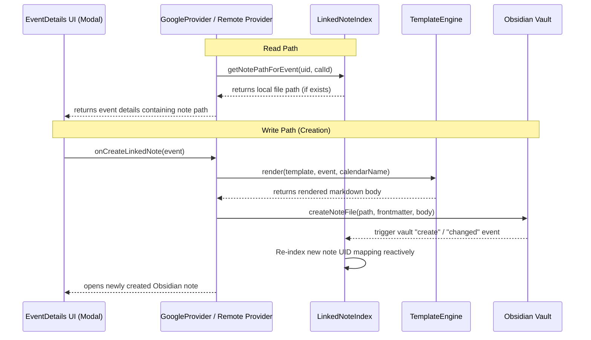

# Event Linked Notes Architecture

!!! abstract "Linked Notes contract"
    Event Linked Notes allow non-markdown remote events (e.g. Google Calendar, CalDAV, Outlook) to be associated with local Obsidian markdown notes. This relationship must remain completely decoupled from the core synchronization and caching engine, adhering strictly to **core-blindness**.

## Core model

| Component | Responsibility | Coupling |
|---|---|---|
| `LinkedNoteIndex` | Reactive index matching remote event UIDs to Obsidian file paths. | Listens to Obsidian vault events; decoupled from EventStore. |
| `TemplateEngine` | Renders a clean markdown body from event fields using a custom layout. | Pure functional renderer; no file system or vault side effects. |
| `noteUtils` | General file-handling, title sanitization, and YAML serialization. | Shared file utility layer; DRY wrapper around Obsidian API. |
| `GoogleProvider` / Remote Providers | Queries the index to return note-linking context during event reads/writes. | Consults `LinkedNoteIndex` without leaking mapping into core registry. |

---

## Architectural Principles & SOLID Boundaries

To prevent architectural regression, this feature is built on three strict modular invariants:

### 1️⃣ Core-Blindness (SOLID: Open-Closed Principle)
The core synchronization layers (`EventCache`), in-memory indexing (`EventStore`), and the global provider registry are **100% blind** to the existence of linked notes. 
Instead of the core mapping files to events:
1. Remote providers (such as `GoogleProvider`) retrieve their events from the cloud.
2. In the `getEvents()` read-path, the provider queries the local `LinkedNoteIndex` for any notes containing the event's `fc-event-uid` (or matching calendar/UID frontmatter parameters).
3. If found, the provider includes the local note path under `EventLocation` in the event payload, allowing the UI to reactively render editing/viewing options.
4. The provider registry and caching system treat this like standard event metadata, completely unaware of the active link.

### 2️⃣ Standalone Body Templating (SOLID: Single Responsibility Principle)
To avoid vault contamination and ensure data cleanliness:
* The frontmatter of the linked note remains **minimal** (e.g., storing only identifiers like `fc-event-uid` and `fc-calendar-id`).
* All rich metadata (title, formatted date, times, location, description, and source calendar name) is rendered directly inside the **body** of the note.
* `TemplateEngine` is a pure utility that parses double-braced expressions (e.g., `{{title}}`, `{{timeString}}`, `{{location}}`) inside customizable layouts, and operates independently of Obsidian's storage or settings UI layers.

### 3️⃣ Reactive Indexing
Rather than executing expensive, repetitive full-vault scans on every calendar load:
* `LinkedNoteIndex` builds and maintains a fast, reactive in-memory index map.
* It leverages Obsidian's native `MetadataCache` to index remote event UIDs from file frontmatter.
* It registers event listeners on `vault.on("create")`, `vault.on("modify")`, `vault.on("delete")`, and `metadataCache.on("changed")` to keep the cache perfectly synchronized in real-time as users add, delete, or modify their notes.

---

## Data Flow

---

## Invariants for Contributors

* **Do not pollute core files**: Never modify `EventCache.ts`, sync modules, or cache stores to orchestrate note creation or path association.
* **Keep frontmatter minimal**: Only add parameters crucial for identity matching (`fc-event-uid`, `fc-calendar-id`) to the YAML frontmatter. Put all other variables in the note body.
* **Always sanitize inputs**: Always pipe event titles through `sanitizeTitleForFilename` to strip OS-reserved characters before attempting a file write.
* **Locale-independent tests**: When asserting date or time strings in the template test suite, always calculate the expected outcome dynamically using Luxon's local formatter to prevent timezone/locale mismatches on test machines.

---

## Integration Anchors

* `src/features/templates/TemplateEngine.ts` - Note body templating engine
* `src/providers/utils/noteUtils.ts` - Shared note/file path & serialization utilities
* `src/providers/utils/LinkedNoteIndex.ts` - Reactive frontmatter-driven indexer
* `src/providers/google/GoogleProvider.ts` - Provider integration anchor
* `src/ui/event_modal.ts` / `src/ui/EventDetails.tsx` - Event details view & button interaction
