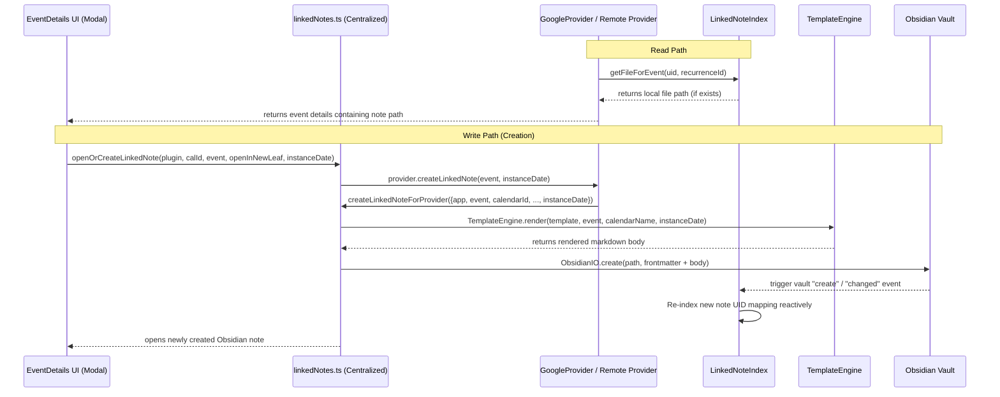

# Event Linked Notes Architecture

!!! abstract "Linked Notes contract"
    Event Linked Notes allow non-markdown remote events (e.g. Google Calendar, CalDAV, Outlook) to be associated with local Obsidian markdown notes. This relationship must remain completely decoupled from the core synchronization and caching engine, adhering strictly to **core-blindness**.

## Core model

| Component | Responsibility | Coupling |
|---|---|---|
| `LinkedNoteIndex` | Reactive index matching remote event UIDs and recurrence IDs to Obsidian file paths. Supports compound key mapping (`eventUid::recurrenceId`) for instance-level note lookup. | Listens to Obsidian vault events; decoupled from [EventStore](../event-storage.md#eventstore-model). |
| `TemplateEngine` | Renders a clean markdown body from event fields using a custom layout. | Pure functional renderer; no file system or vault side effects. |
| `createLinkedNoteForProvider` | Centralized helper that orchestrates note creation for any remote provider. | Combines `TemplateEngine`, `noteUtils`, and `frontmatter` utilities in a single DRY entry point. |
| `noteUtils` | General file-handling, title sanitization, and YAML serialization. | Shared file utility layer; DRY wrapper around Obsidian API. |
| Remote Providers | Delegate to `createLinkedNoteForProvider` for note creation; query `LinkedNoteIndex` during event reads. | Zero manual frontmatter construction in providers. |

---

## Source Of Truth

Linked note identity is **frontmatter-driven**. The canonical identifiers are:

* `fc-event-uid`
* `fc-calendar-id`
* `fc-event-recurrence-id` for instance-specific recurring notes

`LinkedNoteIndex` is only an in-memory projection of those identifiers. Filenames, rendered body text, and cache state are not authoritative and may change without breaking linkage.

## Architectural Principles & SOLID Boundaries

To prevent architectural regression, this feature is built on three strict modular invariants:

### 1️⃣ Core-Blindness (SOLID: Open-Closed Principle)
The core synchronization layers ([EventCache](../eventcache.md)), in-memory indexing ([EventStore](../event-storage.md#eventstore-model)), and the global provider registry are **100% blind** to the existence of linked notes. 
Instead of the core mapping files to events:
1. Remote providers (such as `GoogleProvider` or `CalDAVProvider`) retrieve their events from the cloud.
2. In the `getEvents()` read-path, the provider queries the local `LinkedNoteIndex` for any notes containing the event's `fc-event-uid` (or matching calendar/UID frontmatter parameters).
3. If found, the provider includes the local note path under `EventLocation` in the event payload, allowing the UI to reactively render editing/viewing options.
4. The provider registry and caching system treat this like standard event metadata, completely unaware of the active link.

### 2️⃣ Standalone Body Templating (SOLID: Single Responsibility Principle)
To avoid vault contamination and ensure data cleanliness:
* The frontmatter of the linked note remains **minimal** (e.g., storing only identifiers like `fc-event-uid` and `fc-calendar-id`).
* All rich metadata (title, formatted date, times, location, description, and source calendar name) is rendered directly inside the **body** of the note.
* `TemplateEngine` is a pure utility that parses double-braced expressions (e.g., `{{title}}`, `{{timeString}}`, `{{location}}`) inside customizable layouts, and operates independently of Obsidian's storage or settings UI layers.

### 3️⃣ Reactive Indexing
Rather than executing expensive, repetitive full-vault scans on every calendar load:
* `LinkedNoteIndex` builds and maintains a fast, reactive in-memory index map.
* It leverages Obsidian's native `MetadataCache` to index remote event UIDs from file frontmatter.
* It registers event listeners on `vault.on("create")`, `vault.on("rename")`, `vault.on("delete")`, and `metadataCache.on("changed")` to keep the cache perfectly synchronized in real-time as users add, delete, rename, or modify linked-note files.
* On plugin startup, `LinkedNoteIndex` enters a temporary hydration phase. During this phase it performs an initial scan, a rescan after `workspace.onLayoutReady()`, and listens to `metadataCache.on("resolved")` so pre-existing linked-note files are still discovered even when vault hydration lags behind provider initialization.
* Once startup reconciliation completes, the broad hydration listener becomes inert and steady-state maintenance returns to the directory-scoped listeners only.
* If metadata for a discovered file is still unavailable after any startup scan, the index waits for that specific file's metadata resolution and then reprocesses it before triggering a provider reload.

!!! warning "Residual startup risk boundary"
    Startup restoration is substantially more robust, but not mathematically guaranteed. A missed link after reload now requires a much narrower compound failure: the linked-note file must be absent from the initial scan, absent again at `workspace.onLayoutReady()`, still not become discoverable during `metadataCache.on("resolved")` reconciliation, and also never surface later through the directory-scoped `create`, `rename`, or `changed` events. This boundary is intentionally documented so contributors do not mistake the startup hydration phase for a stronger persistence contract than Obsidian itself exposes.

### 4️⃣ Centralized Note Creation (SOLID: DRY)
All remote providers delegate to a single centralized helper `createLinkedNoteForProvider()` in `src/features/linked-notes/linkedNotes.ts`. This function:
1. Checks if a linked note already exists via `LinkedNoteIndex`.
2. Reads the linked notes directory and template from `PluginState.getSettings()`.
3. Renders the note body via `TemplateEngine`.
4. Constructs minimal frontmatter using `serializeFrontmatter()`.
5. Applies frontmatter using `replaceFrontmatter()` from the FullNote provider utilities.
6. Writes the file via `ObsidianIO`.

No provider implements its own frontmatter construction, template rendering, or file creation logic.

### 5️⃣ Recurring Event Instance Support (Unique Instance Identity)
To resolve note collisions for recurring remote events (daily or weekly meetings), the linking model supports instance-level mapping:
* **Compound Key Indexing**: `LinkedNoteIndex` computes compound keys using `${eventUid}::${recurrenceId}` when the YAML frontmatter includes `fc-event-recurrence-id`.
* **Fallback Strategy**: When querying notes, `LinkedNoteIndex.getFileForEvent(uid, recurrenceId)` prioritizes matching compound keys first, falling back to the master series note (`uid`) only if no instance note exists.
* **Reactive Cache Scrubbing**: During reactive updates, if a note's frontmatter is modified to add or change the recurrence ID, `LinkedNoteIndex` automatically purges the old orphan key pointing to that same file path.
* **Instance-Aware Filenames & Templating**: File names for newly created notes automatically append the occurrence date (e.g., `Weekly Sync 2026-05-20.md`) to avoid vault conflicts, and the `TemplateEngine` uses the instance date to format the `{{date}}` placeholder in the note body.
* **Recurring Identity Source Of Truth**: The recurrence-specific frontmatter field remains canonical. Filename date suffixes are collision-avoidance and readability aids only.

---

## Data Flow

---

## Invariants for Contributors

* **Do not pollute core files**: Never modify [`EventCache.ts`](file:///d:/Codes/plugin-full-calendar/src/core/EventCache.ts), sync modules, or cache stores to orchestrate note creation or path association.
* **Keep frontmatter minimal**: Only add parameters crucial for identity matching (`fc-event-uid`, `fc-calendar-id`) to the YAML frontmatter. Put all other variables in the note body.
* **Always sanitize inputs**: Always pipe event titles through `sanitizeTitleForFilename` to strip OS-reserved characters before attempting a file write.
* **Locale-independent tests**: When asserting date or time strings in the template test suite, always calculate the expected outcome dynamically using Luxon's local formatter to prevent timezone/locale mismatches on test machines.
* **Never duplicate logic in providers**: All note creation must go through `createLinkedNoteForProvider`. Providers must not construct frontmatter, render templates, or create files independently.

---

## Integration Anchors

*   [`src/features/linked-notes/linkedNotes.ts`](file:///d:/Codes/plugin-full-calendar/src/features/linked-notes/linkedNotes.ts) — Centralized note creation helper and open/create orchestrator.
*   [`src/features/linked-notes/TemplateEngine.ts`](file:///d:/Codes/plugin-full-calendar/src/features/linked-notes/TemplateEngine.ts) — Note body templating engine.
*   [`src/providers/utils/noteUtils.ts`](file:///d:/Codes/plugin-full-calendar/src/providers/utils/noteUtils.ts) — Shared note/file path & serialization utilities.
*   [`src/providers/utils/LinkedNoteIndex.ts`](file:///d:/Codes/plugin-full-calendar/src/providers/utils/LinkedNoteIndex.ts) — Reactive frontmatter-driven indexer.
*   [`src/providers/fullnote/frontmatter.ts`](file:///d:/Codes/plugin-full-calendar/src/providers/fullnote/frontmatter.ts) — Frontmatter parsing and serialization.
*   [`src/utils/eventActions.ts`](file:///d:/Codes/plugin-full-calendar/src/utils/eventActions.ts) — Re-exports `openOrCreateLinkedNote` for UI access.
*   [`src/ui/modals/event_modal.ts`](file:///d:/Codes/plugin-full-calendar/src/ui/modals/event_modal.ts) — Event modal with "Open Note" button integration.
*   [`src/ui/settings/sections/renderCalendars.ts`](file:///d:/Codes/plugin-full-calendar/src/ui/settings/sections/renderCalendars.ts) — Linked note settings UI (directory picker + template editor).

---

### 📚 Related Resources

*   [Event Linked Notes User Guide](../../../user/features/event-linked-notes.md) — Learn how to configure directories and design custom templates.
*   [Provider Architecture](../../calendars/architecture.md) — Unified blueprint of remote and local calendar models.

