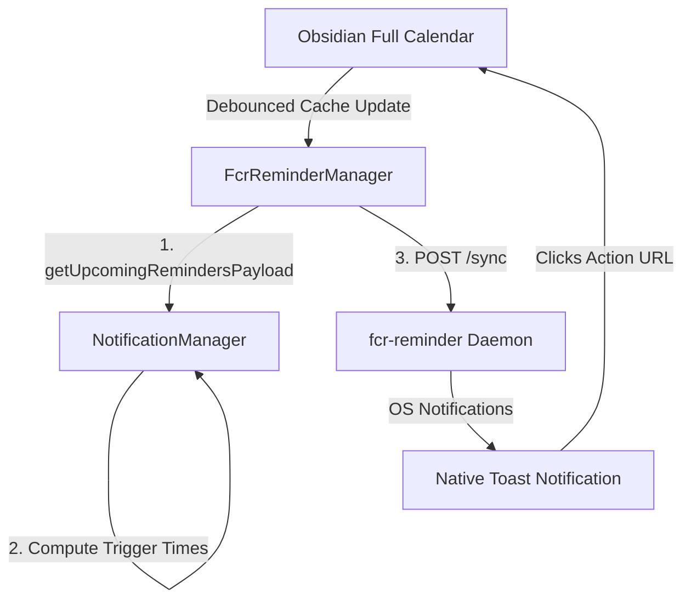

# FCR Reminder Companion Architecture

!!! abstract "Core Contract"
    The FCR Reminder Companion is an offline-first, native system notification extension. It synchronizes upcoming events with a lightweight persistent background daemon, ensuring that native, OS-level toast notifications fire even when Obsidian is completely closed.

---

## System Overview

To provide notification continuity without requiring Obsidian to run constantly in the background, the Full Calendar plugin delegates notification scheduling to a persistent background companion daemon. 



---

## Architectural Modularity and Centralized Calculation

In accordance with SOLID and DRY principles, **`NotificationManager` acts as the single source of truth** for all reminder logic:
1. **Unified Trigger Evaluation**: All calculations of event trigger times (using custom per-event `notify.value` or the global fallback `defaultReminderMinutes`) are owned by `NotificationManager.getTriggerTime()`.
2. **Payload Delegation**: The payload transmitted to the daemon is compiled exclusively via `NotificationManager.getUpcomingRemindersPayload()`, completely eliminating duplication of timing, formatting, and file-link mapping rules.

---

## Synchronization Protocol

### Debouncing and Gates
* **Offline Resiliency**: `FcrReminderManager` queries `/status` on the daemon loopback address before attempting a sync. If offline, the sync is gracefully skipped to avoid network overhead.
* **Debounced Syncing**: To prevent system lag during rapid file updates, cache-change triggers are debounced by `800ms`.

### The Synchronization Payload
The `/sync` endpoint accepts a JSON array containing events starting/triggering within the next 24 hours. The structure of each payload item is:

```typescript
interface FcrReminderPayloadItem {
  id: string;              // Normalized, stable event session ID (appends timestamp for recurring instances)
  title: string;           // Truncated event title (Max 64 chars)
  body: string;            // Truncated event description (Max 256 chars)
  trigger_at_epoch: number; // Unix epoch timestamp (seconds) when the notification should fire
  action_url: string;      // URL encoded obsidian:// protocol deep link to the source file
}
```

### Action URL Deep Linking
To allow users to immediately open the event inside Obsidian upon clicking the OS toast, the `action_url` uses Obsidian's URI protocol:
```
obsidian://open?vault=<vault-name>&file=<url-encoded-file-path>
```

---

## Alert Mutex (Obsidian Bypass)

To prevent duplicate alerts when Obsidian and the companion daemon are running concurrently, `NotificationManager` implements a mutex:
* When `fcrReminderCompanion.enabled` is `true`, standard Obsidian toast alerts (`new Notification(...)`) and their interactive modal popups are bypassed.
* The offline background daemon assumes full ownership of active alerting.

---

[Local Reminders Architecture](reminders-architecture.md) · [EventCache](../../system/eventcache.md) · [NLP Architecture](nlp-architecture.md)
