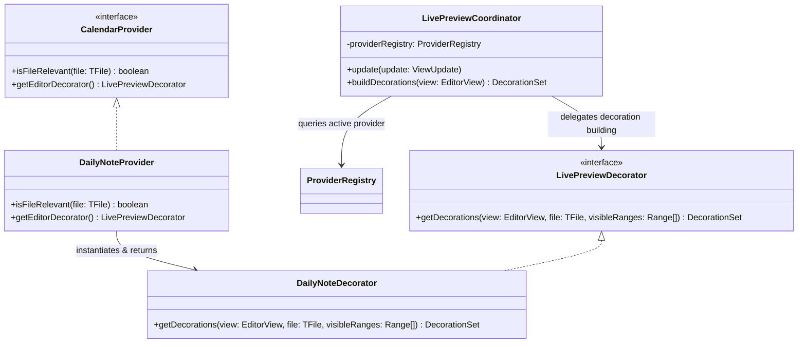

# Live Preview System Architecture

This document details the SOLID, DRY, and high-performance **Provider-Delegated Design Pattern** used to integrate CodeMirror 6 Live Preview decorations in Full Calendar Remastered.

---

## 1. SOLID Design: The Delegation Pattern

To avoid creating a monolithic CodeMirror manager that knows about concrete providers and specific parsing structures, the Live Preview subsystem employs a strictly decoupled **Registry Delegation Pattern**.



### High Cohesion (Single Responsibility Principle)
Visual representations (like inline event pills or frontmatter cards) are packaged directly inside their respective provider directories (e.g., `src/providers/dailynote/codemirror/` and `src/providers/fullnote/codemirror/`). This keeps data parsing logic and visual editor logic localized, preventing feature sprawl across boundaries.

### Open/Closed Principle (OCP)
The central `LivePreviewCoordinator` is a completely generic CodeMirror `ViewPlugin`. It has **zero coupling** to concrete calendar types. It interacts strictly with the `CalendarProvider` and `LivePreviewDecorator` interfaces:
1. It queries the central `ProviderRegistry` to find the active provider for the currently open file.
2. If the provider implements `getEditorDecorator()`, it retrieves the cached decorator instance and delegates the decoration building.
3. Adding a new calendar source with custom editor decorations in the future requires **zero modifications** to the core editor registration layers!

---

## 2. Core Components

### `LivePreviewDecorator`
Exposes the core contract implemented by individual providers:
```typescript
export interface LivePreviewDecorator {
  getDecorations(
    view: EditorView,
    file: TFile,
    visibleRanges: readonly { from: number; to: number }[]
  ): DecorationSet;
}
```

### `LivePreviewCoordinator`
Registered as an Obsidian Editor Extension, it acts as the primary event loop observer:
* **Lifecycle**: Listens for editor state transitions inside its `update(update: ViewUpdate)` loop.
* **Smart Invalidation**: Rebuilds decorations only if:
  1. The active editor file changes.
  2. The document contents are modified (`update.docChanged`).
  3. The cursor selection or line position changes (`update.selectionSet`).
  4. The viewport scroll state changes (`update.viewportChanged`).

---

## 3. High-Performance Techniques

### Active-Line Exclusion
To prevent visual lag and coordinate natural writing workflows, we perform **active-line exclusion**:
1. During `getDecorations`, we retrieve the user's cursor line index using `view.state.doc.lineAt(selection.head).number`.
2. We skip applying `Decoration.replace` widgets to the line currently hosting the cursor, allowing the editor to render the native plain-text markdown seamlessly.

### Widget Lifecycle and DOM Recycling (`eq` optimization)
To prevent continuous layout recalculation and DOM rebuilding during typing or scrolling, the `InlineEventWidget` and `FrontmatterCardWidget` implement strict `eq` comparison overrides:
```typescript
eq(other: InlineEventWidget): boolean {
  return (
    this.text === other.text &&
    this.eventId === other.eventId &&
    this.color === other.color &&
    this.title === other.title &&
    this.startTime === other.startTime &&
    this.endTime === other.endTime &&
    this.category === other.category &&
    this.completed === other.completed
  );
}
```
CodeMirror uses this check to automatically recycle the existing DOM node instead of destroying and recreating elements when updating editor ranges.
