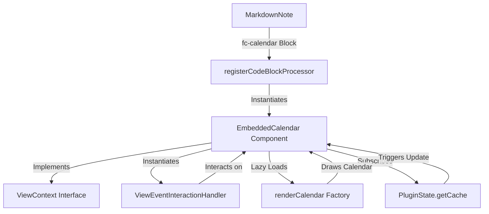

# Embedded Code Block Calendars Architecture

This document describes the architectural design and structural patterns used to implement the flexible, high-performance embedded code block calendar subsystem in Obsidian Full Calendar.

---

## 1. Architectural Blueprint (Mermaid Diagram)



---

## 2. Structural Design Patterns

The embedded calendar feature adheres to strict modularity, DRY (Don't Repeat Yourself), and reactive programming patterns.

### A. Polymorphic ViewContext & DRY Interactions
To avoid duplicating the extensive interaction logic (handling slot selections, context menus, dragging, rescheduling, and task toggles), `EmbeddedCalendar` implements the core `ViewContext` interface defined in `src/ui/calendar/ViewContext.ts`:

```typescript
export interface ViewContext {
  plugin: FullCalendarPlugin;
  app: App;
  containerEl: HTMLElement;
  contentEl: HTMLElement;
  inSidebar: boolean;
  get fullCalendarView(): Calendar | null;
  get viewEnhancer(): ViewEnhancer | null;
  refreshView(): Promise<void>;
}
```

By satisfying this interface, the embedded component can delegate **all** user event callbacks directly to the existing `ViewEventInteractionHandler` class without rewriting any event synchronization or vault editing logic:

```typescript
this.interactionHandler = new ViewEventInteractionHandler(this);

// Directly hook callbacks:
select: async (start, end, allDay, viewType) => {
  this.activeCalendar = cal;
  await this.interactionHandler.handleSelect(start, end, allDay, viewType);
}
```

### B. Dynamic Active-Calendar Routing
When rendering multiple sub-views side-by-side (in `layout` grid configuration), a single `EmbeddedCalendar` component manages an array of `Calendar` instances (`private calendars: Calendar[]`). 

To allow the single-instance-oriented `ViewEventInteractionHandler` to operate seamlessly on the specific sub-view being interacted with:
* The component tracks a temporary `private activeCalendar: Calendar | null = null;`.
* Inside each calendar's callback triggers, `activeCalendar` is updated to the target calendar before invoking the handler.
* The `ViewContext.fullCalendarView` getter dynamically routes the call to the active calendar:
  ```typescript
  get fullCalendarView(): Calendar | null {
    return this.activeCalendar || this.calendars[0] || null;
  }
  ```

### C. Performance & Resource Efficiency
1. **Dynamic Code Splitting**: FullCalendar and its plugins (daygrid, timegrid, list, etc.) are heavy dependencies. The processor dynamically loads these bundles *only* when a code block mounts on the screen, preserving a fast startup speed for Obsidian.
2. **IntersectionObserver (Lazy Initialization)**: Calendars are not rendered immediately upon note load. Instead, the component registers an `IntersectionObserver` to defer initialization until the block scrolls into view.
3. **In-Memory Cache Subscriptions**: Instead of executing costly disk reads or re-parsing markdown, the embedded calendars register as lightweight observers on the central reactive `EventCache` (`PluginState.getCache().on('update', callback)`). When a file changes, the cache computes the diff and triggers the callback, allowing all embedded calendars to update reactively and flicker-free.
4. **Metadata & Content Filtering**: Advanced filters (`titleFilter`, `tagFilter`, `pathFilter`) are applied directly on the cached event arrays during memory extraction, yielding maximum efficiency.
