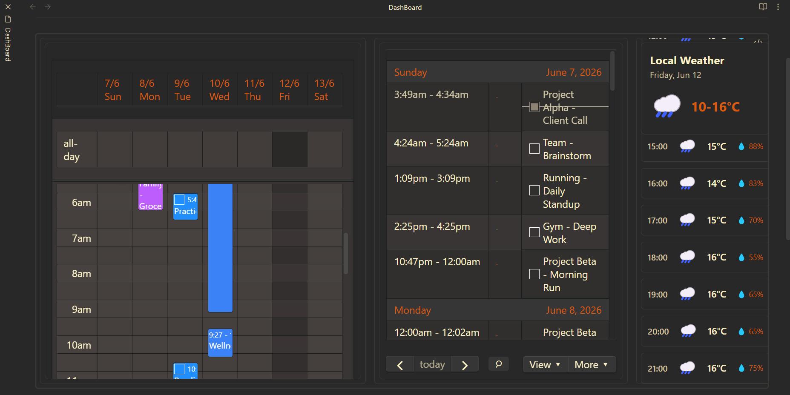

# Blueprints Showcase Database

This file acts as the database for the interactive dashboard showcase page. A Python hook parses this file during build to generate the responsive showcase grid.

## How to Add New Showcase Cards

To add a new showcase item:
1. Append a horizontal rule separator (`---`) on a new line at the bottom of this file.
2. Define the title of the dashboard using a Level 2 header (`## Your Title`).
3. Define the image path using `**Image**: ../../assets/embedded-showcase/your_image.png`.
4. Define a short summary using `**Summary**: A one-line description for the card preview`.
5. Add the detailed description, instructions, and list of features.
6. Provide the copyable configuration code block wrapped in an outer 4-backtick fence:
   
   ````yaml
   ```fc-calendar
   # your configuration here
   ```
   ````

*Note: This header instruction section before the first horizontal rule (`---`) is automatically ignored by the build parser.*

---

## Multi-View Daily Planner
**Image**: 
**Summary**: A multi-column setup combining a weekly planner, work focus agenda list, and a daily weather forecast.

Designed for daily note dashboards. It locks to the note's date automatically and displays your week's calendar, a list of your weekly goals/tasks, and your weather updates side-by-side.

#### Key Features

* **Automatic Date Locking**: Syncs seamlessly to the active note's daily date anchor.
* **Multi-View Layout**: Combines `timeGridWeek`, `listWeek`, and vertical `weather` side-by-side.
* **Optimized Dimensions**: Customized panel widths for responsive visual hierarchy.

#### Configuration Code

````yaml
```fc-calendar
defaultDate: auto    # Automatically locks to the date of your Daily Note!
calendars:
  - DailyNote
height: 650px    
layout:
  orientation: horizontal
  views:
    # Column 1: Daily Schedule
    - view: timeGridWeek
      width: 45%
      weather: false
      header: false
      
    # Column 2: Weekly Work Focus List
    - view: listWeek
      width: 35%
      weather: false
      header: true
      
    # Column 3: Weather
    - view: weather
      type: day
      orientation: vertical
      width: 20%
```
````
